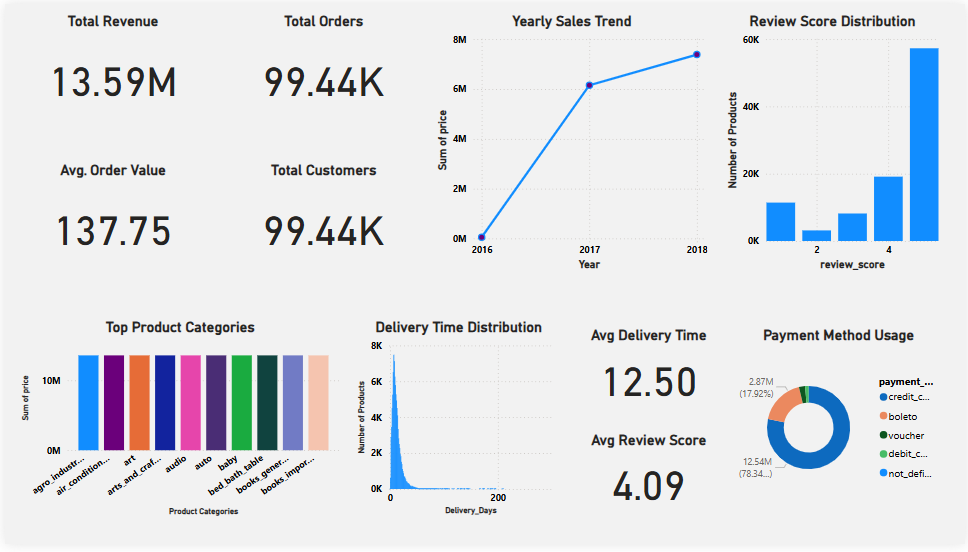
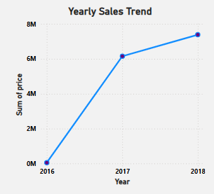
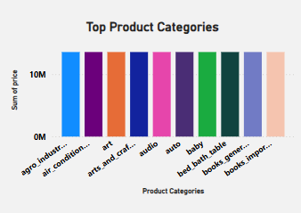

# 🛒 E-Commerce Sales Analysis Dashboard (Power BI) – Olist Dataset

This project is a complete end-to-end data analytics and business intelligence solution built using the **Brazilian E-Commerce Public Dataset (Olist)** available on Kaggle. The objective was to perform data cleaning, transformation, and create an interactive Power BI dashboard to generate valuable business insights.

---

## 📊 Dashboard Overview

 <!-- upload your dashboard image in the repo -->

The dashboard includes:

- ✅ Total Revenue, Orders, Customers, Avg Order Value (KPIs)
- 📈 Monthly Sales Trend
- 📦 Top 10 Product Categories by Revenue
- 💳 Payment Type Distribution
- ⭐ Review Score Analysis
- 🚚 Delivery Time Performance

---

## 📁 Dataset Source

- [Kaggle - Brazilian E-Commerce Public Dataset by Olist](https://www.kaggle.com/datasets/olistbr/brazilian-ecommerce)

Contains 100k+ orders, customer info, product details, payments, reviews, and delivery logs.

---

## 🛠️ Tools & Technologies Used

- **Power BI** – Visualizations, Data Modeling, DAX
- **Power Query Editor** – Data Cleaning & Transformation
- **DAX** – Custom measures & KPIs
- (Optional) **Python (Pandas)** – For initial preprocessing (if used)

---

## 📈 Business Insights Derived

- Majority of orders are placed from top 5 product categories.
- Credit card is the most preferred payment method.
- Delivery time varies with location, average is ~10 days.
- Most customers gave 5-star ratings (indicating good experience).
- Orders peak during certain months of the year.

---

## 🧠 Learnings

- Creating and managing relationships in Power BI
- Designing clean and interactive dashboards
- Writing custom DAX formulas
- Extracting business insights from messy, real-world data

---

## 📸 Preview

| Dashboard | Sales Trend | Top Categories |
|----------|-------------|----------------|
|  |  |  |

---

## 🧾 Author

**Anshuman Mishra**  
Data Analyst | Python + Power BI Enthusiast  
📫 Connect with me on [LinkedIn](https://www.linkedin.com/in/anshuman-mishra-profile-link)  
📁 Explore more: [GrowWithAnshuman](https://www.youtube.com/@GrowWithAnshuman)

